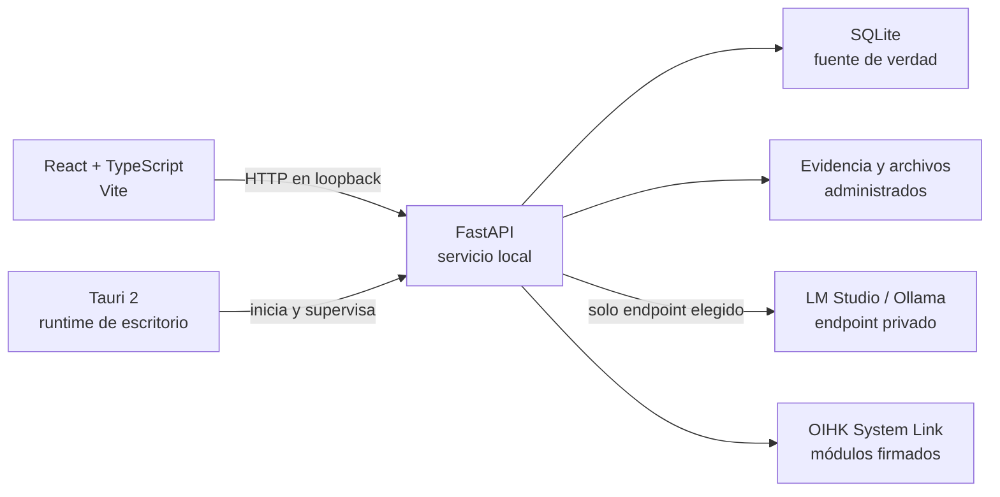

<div align="center">
  <a href="https://ko-fi.com/broskigx">
    
  </a>
</div>

# OIHK Basic

[](https://github.com/Broskigx/OIHK-Basic/actions/workflows/ci.yml)
[](VERSION)
[](LICENSE)
[](PRIVACY.md)
[](CONTRIBUTING.md)

Plataforma de investigación local-first para organizar casos autorizados, evidencia, fuentes, relaciones, reportes y flujos de IA local desde una aplicación de escritorio Tauri.

> [!IMPORTANT]
> **OIHK Basic es software beta.** El código está probado y auditado, pero la distribución todavía no. Conserva backups externos verificados y no lo uses como única copia de evidencia o de una investigación real.

## Contenido

- [Estado del proyecto](#estado-del-proyecto)
- [Qué incluye](#qué-incluye)
- [Inicio rápido desde un clon](#inicio-rápido-desde-un-clon)
- [Primera apertura y modelos locales](#primera-apertura-y-modelos-locales)
- [Configuración manual de LM Studio u Ollama](#configuración-manual-de-lm-studio-u-ollama)
- [Arquitectura](#arquitectura)
- [Calidad y pruebas](#calidad-y-pruebas)
- [Seguridad, privacidad y uso responsable](#seguridad-privacidad-y-uso-responsable)
- [Builds y releases](#builds-y-releases)
- [Documentación](#documentación)

## Estado del proyecto

La versión actual es `0.2.0-beta.1`.

### Qué está validado

- **517 pruebas automatizadas** en verde: 382 de backend y 135 de frontend, más el desktop. La superficie REST tiene pruebas de integración sobre HTTP real, atravesando el stack de middleware completo y con claves foráneas activas. El API de módulo de System Link se ejercita con sobres firmados de verdad, y cada capacidad tiene un caso de denegación junto al de éxito.
- **78 % de cobertura** medida correctamente. El instrumental declara la concurrencia de greenlet que usa la capa asyncio de SQLAlchemy; sin eso perdía el rastro en cada `await` contra la base de datos y subestimaba la cobertura de prácticamente todas las rutas.
- **Auditorías de dependencias sin vulnerabilidades conocidas**: `pip-audit` y `npm audit` limpios; `cargo audit` pasa con 17 avisos permitidos por crates transitivos sin mantenimiento del stack GTK/Tauri, ninguno de ellos una vulnerabilidad. Gitleaks escanea el historial completo.
- **El límite del navegador está cerrado**: validación de `Host` y de `Origin` en el API de loopback, con pruebas dedicadas. Consulta [Threat Model](THREAT_MODEL.md) T4.11 y T4.12.

### Qué falta por validar

Estos gates dependen de infraestructura y hardware, no del código, y son la razón por la que esto es `beta.1` y no una estable:

- Instalación, actualización y desinstalación en una **VM Windows limpia**.
- El **updater firmado** con las claves de producción, contra un endpoint HTTPS controlado.
- Los artefactos de **macOS y Linux**: compilan, pero no se declaran release-ready.

Hasta que esos tres se cierren, los artefactos de GitHub Actions no deben tratarse como instaladores oficiales, y no se garantiza compatibilidad de datos entre versiones.

El canal del updater sigue siendo `alpha` de forma deliberada: cambiarlo mueve el punto donde las instalaciones existentes buscan actualizaciones, y esa es una decisión de release, no de código.

## Qué incluye

OIHK Basic reúne once capacidades principales. Diez son espacios de trabajo con su propia ruta; Copilot vive en un dock disponible desde cualquiera de ellas.

El análisis forense ya no está aquí. La adquisición, el hashing, el carving y el análisis viven en **OIHK Evidence Lab**, que se instala por separado, carga desde su propia carpeta y se vincula por System Link; Basic renderiza su superficie y conserva la cadena de custodia.

1. **Dashboard operativo** con actividad reciente, estado local y accesos rápidos.
2. **Investigations** para crear, editar, duplicar, archivar, restaurar, importar y exportar casos.
3. **Intelligence Graph** sobre Canvas 2D con cámara, minimapa, layouts, filtros, pinning, selección múltiple, undo/redo y snapshots persistentes.
4. **OSINT Workspace** con consultas explícitas, historial SQLite, cancelación y promoción controlada al grafo.
5. **Custody register** como registro, no como laboratorio: lista lo que la instalación conserva para un caso, distingue los ficheros que guarda de los que solo referencia en un módulo vinculado, re-hashea un fichero contra su sello y **conserva el veredicto** —un fallo de integridad sigue visible al día siguiente—, exporta el manifiesto y permite retirar una pieza. Retirar es una acción exclusiva del operador: ninguna capacidad de módulo concede borrado. La adquisición y el análisis los hace Evidence Lab.
6. **Reports** con secciones, plantillas, Markdown, HTML seguro, JSON, historial y aprobación de borradores.
7. **Copilot** en un dock acoplado a la interfaz, con conversaciones persistentes, un modelo local elegido por el usuario y un conjunto acotado de operaciones que puede invocar por nombre. No puede modificar ni borrar evidencia, ni aprobar reportes, y toda escritura queda auditada.
8. **Local Models** con detección y configuración de LM Studio, Ollama y endpoints privados OpenAI-compatible.
9. **Data Sources** para procedencia, citas y confiabilidad.
10. **Settings** para apariencia, privacidad, rendimiento, backups y diagnósticos sanitizados.
11. **OIHK System Link** para vincular módulos OIHK instalados de forma separada mediante identidades y capacidades verificadas. Las quince capacidades que se pueden conceder tienen un endpoint que las exige: conceder y permitir son lo mismo, y un test falla si alguna vez dejan de serlo.

Varias capacidades siguen en desarrollo o validación. Consulta [las limitaciones conocidas](docs/KNOWN_LIMITATIONS.md) antes de probar el proyecto.

## Inicio rápido desde un clon

### Requisitos

- Git.
- Python 3.11 o superior.
- Node.js 22 (`>=22 <23`).
- Rust estable y Cargo.
- Dependencias nativas de Tauri 2 para tu sistema operativo; consulta [la guía de compilación](docs/BUILDING.md).

### 1. Clonar e instalar dependencias

```powershell
git clone https://github.com/Broskigx/OIHK-Basic.git
cd OIHK-Basic

cd backend
python -m venv .venv
.\.venv\Scripts\Activate.ps1
python -m pip install --upgrade pip
python -m pip install -e ".[dev]"

cd ..\frontend
npm ci
```

En Linux o macOS, activa el entorno Python con `source backend/.venv/bin/activate`.

### 2. Ejecutar la aplicación web de desarrollo

Backend, terminal 1:

```powershell
cd backend
.\.venv\Scripts\Activate.ps1
python run.py
```

Frontend, terminal 2:

```powershell
cd frontend
npm run dev
```

La interfaz queda normalmente en `http://127.0.0.1:5173` y la API en `http://127.0.0.1:8000`.

### 3. Ejecutar OIHK Basic con Tauri

El modo Tauri de desarrollo administra el backend local, pero Vite debe estar abierto:

```powershell
# Terminal 1
cd frontend
npm run dev

# Terminal 2 (con el entorno Python del backend activo)
cd frontend
npm run desktop:dev
```

Tauri selecciona un puerto libre en loopback, inicia `backend/run.py`, espera su health check y cierra el proceso administrado al salir de la aplicación. El build empaquetado utiliza el sidecar incluido y no requiere Python instalado.

## Primera apertura y modelos locales

En un perfil nuevo, `onboarding_complete` comienza en `false`. Al abrir OIHK Basic por primera vez, el onboarding inicia automáticamente y, en paralelo, comprueba dos endpoints de loopback:

| Runtime | Endpoint detectado | Protocolo |
| --- | --- | --- |
| LM Studio | `http://127.0.0.1:1234` | API local OpenAI-compatible |
| Ollama | `http://127.0.0.1:11434` | API nativa de Ollama |

Si un runtime responde, aparece la animación **“LM Studio detected”** o **“Ollama detected”** con la opción de revisar y conectarlo. El usuario puede:

1. elegir uno de los servicios detectados;
2. seleccionar uno de sus modelos cargados;
3. guardar la conexión local con **Connect**;
4. omitir el paso y seguir usando todas las funciones que no requieren IA;
5. abrir la configuración manual.

La detección solo lista servicios y modelos. No descarga pesos, no inicia Ollama o LM Studio, no usa una cuenta cloud y no ejecuta inferencia. El onboarding puede volver a abrirse desde **Settings → Run onboarding again**.

## Configuración manual de LM Studio u Ollama

La ruta **Local Models** permanece disponible aunque la detección automática no encuentre nada.

### LM Studio

1. Abre LM Studio y carga un modelo.
2. Inicia su servidor local OpenAI-compatible, normalmente en el puerto `1234`.
3. En OIHK Basic abre **Local Models**.
4. Selecciona **LM Studio** e ingresa `http://127.0.0.1:1234`.
5. Pulsa **List models**, elige un modelo, guarda la configuración y usa **Test inference**.

### Ollama

1. Instala Ollama y asegúrate de tener al menos un modelo local.
2. Inicia el servicio con `ollama serve` si no se está ejecutando como servicio del sistema.
3. En OIHK Basic abre **Local Models**.
4. Selecciona **Ollama** e ingresa `http://127.0.0.1:11434`.
5. Pulsa **List models**, elige un modelo, guarda la configuración y usa **Test inference**.

También se permiten endpoints HTTP(S) en IP privadas o link-local. Las URLs públicas y las credenciales embebidas en la URL se rechazan. Para cambiar los puertos que usa el detector automático en desarrollo:

```powershell
$env:OIHK_LM_STUDIO_ENDPOINT = "http://127.0.0.1:1234"
$env:OIHK_OLLAMA_ENDPOINT = "http://127.0.0.1:11434"
```

OIHK Basic no incluye modelos ni administra su instalación. La calidad, licencia, requisitos de hardware y seguridad de cada modelo son responsabilidad de quien lo ejecuta.

## Arquitectura



Principios de diseño:

- SQLite y los archivos locales son la fuente de verdad.
- La edición desktop sin autenticación escucha únicamente en loopback.
- No hay telemetría obligatoria, sincronización cloud, Redis, GraphQL, licencias ni facturación.
- Copilot no tiene fallback silencioso a un proveedor cloud.
- Una consulta OSINT no modifica el grafo hasta que el usuario promueve explícitamente el resultado.
- La evidencia no se ejecuta: se limita por tamaño, se copia a almacenamiento administrado y se verifica por hash.
- El sistema no debe fabricar resultados, fuentes ni métricas.

### Estructura del repositorio

| Ruta | Responsabilidad |
| --- | --- |
| `frontend/` | React, TypeScript, diseño de producto, grafo Canvas y cliente API. |
| `backend/app/` | FastAPI, servicios, adapters de modelos locales, persistencia y reglas de seguridad. |
| `backend/tests/` | Pruebas del servicio local y regresiones. |
| `src-tauri/` | Lifecycle desktop, sidecar, CSP, updater y empaquetado. |
| `scripts/` | Builds reproducibles, auditorías y smoke tests por plataforma. |
| `docs/` | Contratos, builds, releases, updater, System Link y limitaciones. |

## Calidad y pruebas

Desde la raíz del repositorio:

```powershell
# Python
python -m ruff check backend/app backend/run.py backend/tests scripts tests
python -m pytest backend/tests tests -q

# Frontend
cd frontend
npm run check
npm run test -- --run
npm run build
npm audit --audit-level=high

# Desktop
cd ..\src-tauri
cargo fmt -- --check
cargo check --locked
cargo test --locked --all-targets
```

Auditorías de dependencias recomendadas:

```powershell
python -m pip_audit
cd frontend
npm audit --audit-level=high
```

### Cobertura

```powershell
python -m pytest backend/tests tests -q --cov=app --cov-report=term-missing
```

CI ejecuta la cobertura dentro del mismo paso de pruebas, con un suelo del 70 %. Es una protección contra regresiones —que una ruta entera pierda sus pruebas—, no un objetivo que perseguir.

Dos detalles de configuración que hacen que estas cifras sean fiables, y que conviene no deshacer:

- **`concurrency = ["greenlet", "thread"]`** en `[tool.coverage.run]`. La capa asyncio de SQLAlchemy conmuta greenlets, y sin declararlo el tracer pierde el marco tras cada `await session.execute(...)` y reporta la línea siguiente como no ejecutada. Medido: declararlo llevó el router de casos de un 38 % reportado a un 91 % real sin cambiar una sola prueba.
- **`ruff.toml` en la raíz** extiende `backend/pyproject.toml`, de modo que ruff aplica las mismas reglas desde la raíz, desde el editor y en CI. Sin él, una ejecución desde la raíz perdía `known-first-party = ["app"]` y reportaba errores de orden de imports que CI consideraba limpios.

### Cómo están escritas las pruebas del backend

Las pruebas de integración usan las fixtures compartidas de `backend/tests/conftest.py`: cada una recibe una base de datos SQLite propia con `foreign_keys=ON` y atraviesa el stack de middleware real sobre HTTP. Solo se sustituyen la factoría de sesiones y la identidad autenticada.

El esquema se construye una vez por sesión y se copia por prueba; emitir todo el DDL en cada una dominaba el tiempo de ejecución. La suite completa tarda alrededor de dos minutos.

La integración continua ejecuta lint, pruebas con cobertura, builds, auditorías, Gitleaks, smoke tests del sidecar y validaciones de empaquetado. Un pipeline verde reduce riesgos conocidos, pero no sustituye la validación de distribución que sigue pendiente.

System Link incluye además un smoke E2E real contra un clon local de OIHK Evidence Lab:

```powershell
python scripts/smoke_system_link_e2e.py --evidence-lab C:\path\to\OiHK-evidence-lab
```

Ese smoke valida pairing, aprobación, Power On/Off, autenticación mutua, health `READY`, capabilities y rechazo de replay o paquetes alterados.

## Evidencia, reportes y backups

- La vista previa inline se limita a tipos raster considerados seguros; otros archivos se entregan como attachments.
- Los reportes exportan Markdown, HTML seguro y JSON estructurado. PDF y DOCX no forman parte del producto actual.
- Cambiar el directorio de almacenamiento requiere backup y reinicio; la relocalización en vivo está bloqueada deliberadamente.
- Backups, migraciones y recuperación continúan en evolución y no constituyen una garantía absoluta de integridad.

## Seguridad, privacidad y uso responsable

OIHK Basic está destinado al trabajo autorizado con fuentes públicas o datos incorporados legalmente por el usuario. No autoriza acceso a sistemas, cuentas ni datos privados de terceros.

- Usa datos desechables mientras la validación de distribución siga abierta.
- Conserva backups externos y prueba su restauración.
- Revisa toda salida de un modelo antes de incorporarla a una investigación o reporte.
- No expongas el backend sin autenticación mediante port forwarding, proxy inverso o bind público.
- Reporta vulnerabilidades mediante un advisory privado de GitHub; no adjuntes evidencia real ni secretos.

Consulta [Security Policy](SECURITY.md), [Privacy](PRIVACY.md), [Threat Model](THREAT_MODEL.md) y [Responsible Use](RESPONSIBLE_USE.md).

### El navegador también está dentro del límite de confianza

Escuchar solo en loopback protege frente a un atacante *de red*, no frente a una página web que abra la persona usuaria. El navegador puede hacer peticiones a `127.0.0.1`, así que dos controles se aplican en toda petición sin importar el modo de autenticación:

- **Validación de `Host`.** Se comprueba en todos los métodos, incluidas las lecturas. Un bind loopback acepta únicamente autoridades loopback, que es lo que rechaza una respuesta de DNS rebinding apuntando un dominio del atacante al puerto local.
- **Validación de `Origin`.** Los métodos que modifican estado se contrastan con la lista de orígenes permitidos antes del enrutado y antes de leer el cuerpo. CORS nunca impidió una *escritura* cross-origin: las rutas que aceptan `multipart/form-data` —crear un perfil de target con su fotografía, por ejemplo— usan un content-type de la CORS safelist que no dispara preflight, así que una página hostil podría plantar un archivo en un caso y limitarse a no leer la respuesta.

Las peticiones sin `Origin` son clientes que no son navegadores —el core de Tauri, el runner de smoke de System Link— y pasan con normalidad.

### Variables de configuración relevantes

| Variable | Efecto |
| --- | --- |
| `OIHK_CORS_ORIGINS` | Orígenes permitidos. Es también la lista contra la que se validan los cambios de estado cross-origin. |
| `OIHK_ALLOWED_HOSTS` | Autoridades `Host` aceptadas. Vacío es correcto en loopback: se deriva solo. Una entrada sin puerto acepta cualquier puerto. |
| `OIHK_DOCS_ENABLED` | Fuerza `/docs`, `/redoc` y `/openapi.json`. Activos en desarrollo, retirados en el build de escritorio y en producción. |

### Autenticación opcional

OIHK Basic es monousuario y local por defecto. Con `OIHK_AUTH_ENABLED=false`, el backend se niega a iniciar en un bind no-loopback. Los despliegues personalizados pueden activar autenticación con `OIHK_AUTH_ENABLED=true`, pero ese modo recibe menos ejercicio que el monousuario y conviene tratarlo como menos maduro.

Un despliegue fuera de loopback no puede derivar su lista de `Host`, así que en producción el servidor se niega a arrancar sin `OIHK_ALLOWED_HOSTS` en lugar de dejar el control abierto.

## OIHK System Link

System Link enlaza productos OIHK instalados por separado mediante identidades Ed25519, pairing local con una Link Key temporal y de un solo uso, grants de capacidades, manifests hasheados y estados de lifecycle explícitos.

OIHK Evidence Lab no está embebido en Basic: conserva instalación, proceso, UI, dominio y datos propios. Basic actúa únicamente como host/control plane y continúa funcionando sin módulos vinculados.

**Conceder una capacidad y permitirla son lo mismo.** Las quince capacidades del protocolo tienen un endpoint que las exige —casos, fuentes, entidades y relaciones, escritura, importación y anotación de evidencia, secciones de reporte, notificaciones y estado del runtime—, y un test lee la lista desde el código fuente y falla si alguna vez se declara una sin ruta detrás. Toda escritura de un módulo queda auditada como `module:<id>`, nunca confundible con una persona.

Tres límites son deliberados y tienen su test: un módulo puede enriquecer la descripción de un caso pero no reescribir su base legal, su alcance ni su estado; puede anotar una pieza de evidencia pero no tocar el digest que cubre el sello; y puede añadir hallazgos a un borrador de reporte pero no a uno aprobado.

El bridge de la UI del módulo comprueba los grants concedidos a *ese* módulo antes de servir una operación. La superficie se sirve con la sesión del operador, así que el servidor ve a una persona autorizada y no al módulo: sin esa comprobación, un módulo aprobado solo para navegación podría leer todos los casos y toda la evidencia de la instalación. El bridge es de solo lectura; las escrituras van por el API firmado.

El emparejamiento no comprueba nombres. La confianza viene de la firma del editor verificada contra anclas Ed25519 embebidas, no de una lista cableada de módulos permitidos, así que cualquier módulo correctamente firmado puede vincularse.

System Link no acepta comandos shell ni scripts arbitrarios. Solo puede ejecutar el binario relativo registrado bajo un root de instalación después de verificar su SHA-256. El contrato, las identidades Ed25519, el bridge UI y los límites de capabilities están documentados en [System Link v1](docs/SYSTEM_LINK_V1.md).

## Diferencia frente a OIHK normal

OIHK Basic conserva un flujo local de investigación, custodia de evidencia, grafo, modelos y módulos vinculados, pero no incluye colaboración multiusuario, organizations, enterprise SSO, sincronización cloud, administración de conectores privados, billing, licensing, Redis, queues, GraphQL, infraestructura distribuida ni papas fritas 🍟. OIHK normal y OIHK Basic son productos separados.

## Builds y releases

Build local Windows sin firma ni updater:

```powershell
cd frontend
npm run release:local
```

No distribuyas ese instalador como versión oficial. Los releases firmados requieren secretos de CI y un proceso separado de validación que todavía no se ha cerrado. Consulta [Building](docs/BUILDING.md), [Releasing](docs/RELEASING.md) y [Updates](docs/UPDATES.md).

## Documentación

- [Guía de contribución](CONTRIBUTING.md)
- [Build por plataforma](docs/BUILDING.md)
- [Arquitectura](docs/ARCHITECTURE.md)
- [Limitaciones conocidas](docs/KNOWN_LIMITATIONS.md)
- [Arquitectura del updater](docs/UPDATES.md)
- [Proceso de release](docs/RELEASING.md)
- [System Link v1](docs/SYSTEM_LINK_V1.md)
- [Security Policy](SECURITY.md)
- [Privacy](PRIVACY.md)
- [Threat Model](THREAT_MODEL.md)
- [Responsible Use](RESPONSIBLE_USE.md)
- [Changelog](CHANGELOG.md)

## Licencia

MIT. Consulta [LICENSE](LICENSE).
