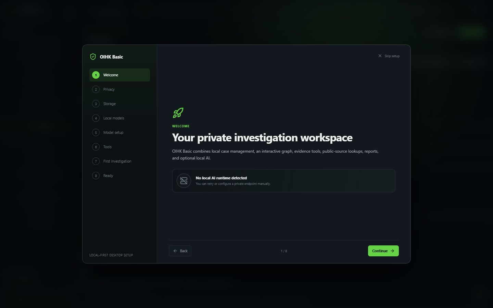
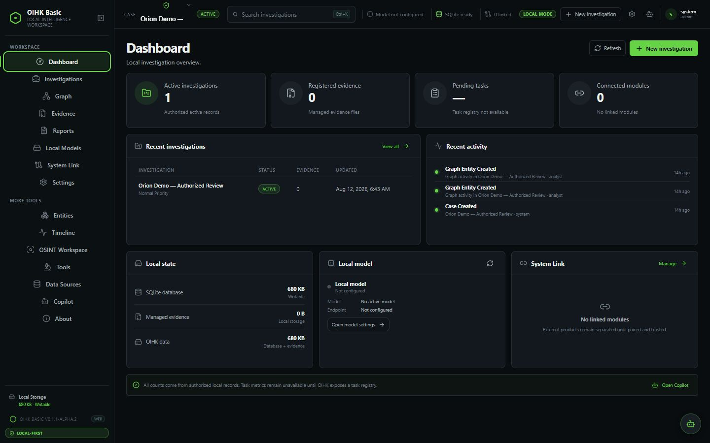
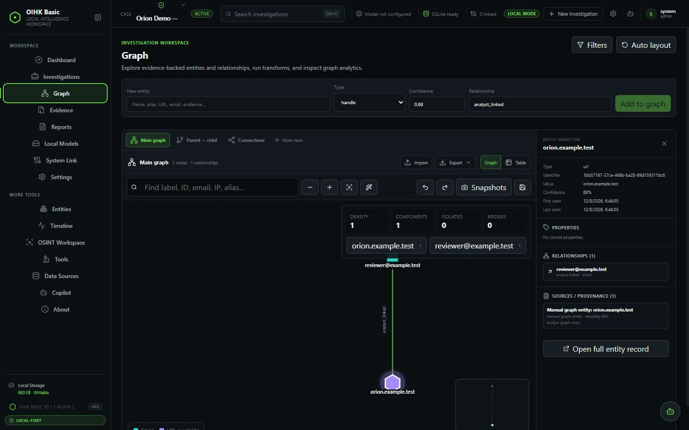
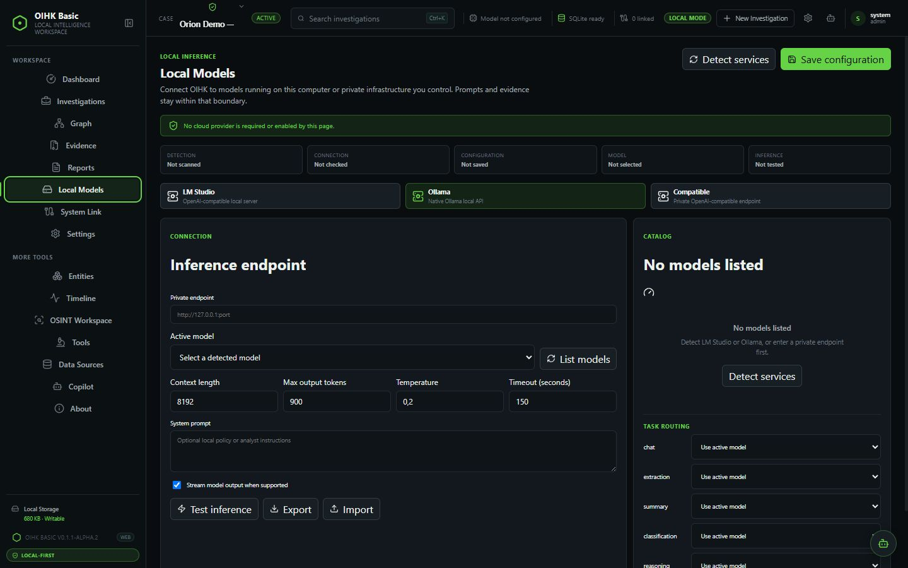
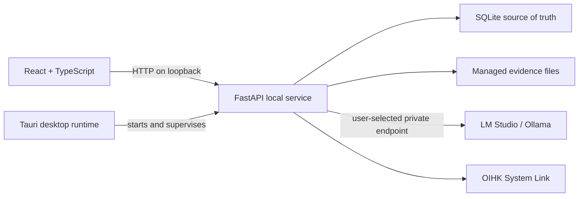

<div align="center">

# OIHK Basic

**A local-first desktop workspace for authorized investigations, evidence, relationships, reports, and optional local AI.**

[](https://github.com/Broskigx/OIHK-Basic/actions/workflows/ci.yml)
[](VERSION)
[](LICENSE)
[](PRIVACY.md)

[Quick start](#quick-start) · [First run](#first-run) · [Build from source](docs/BUILDING.md) · [Troubleshooting](docs/TROUBLESHOOTING.md)

</div>

> [!WARNING]
> OIHK Basic is alpha software for technical evaluation and controlled testing. There is no production-ready release or generally supported installer. Use disposable data, keep verified external backups, and expect breaking changes.

## What it is

OIHK Basic is the single-user, local-first edition of OIHK. It combines a React/Tauri desktop interface with a loopback FastAPI service and SQLite storage. It can organize investigations, build an intelligence graph, manage evidence, query supported public sources, draft reports, and use a model served by LM Studio, Ollama, or another private OpenAI-compatible endpoint.

Basic also acts as a control plane for separately installed first-party OIHK modules through **OIHK System Link**. OIHK Evidence Lab is not bundled or embedded: the **Evidence** workspace in Basic manages investigation evidence, while the external Evidence Lab product retains its own process, UI, data, and lifecycle.

| Workspace | Current capability |
| --- | --- |
| Dashboard | Local status, recent activity, and honest shortcuts derived from the local database. |
| Investigations | Create, edit, duplicate, archive, restore, import, and export cases. |
| Intelligence Graph | Canvas graph, layouts, filters, snapshots, undo/redo, and explicit result promotion. |
| OSINT | DNS, RDAP/WHOIS, and certificate-transparency lookups with local history and cancellation. |
| Evidence | Managed uploads, SHA-256 verification, associations, manifests, and forensic utilities. |
| Reports | Structured drafts with Markdown, safe HTML, and JSON export. |
| Copilot | Persistent conversations using the model endpoint selected by the user. |
| Local Models | Detection, configuration, model selection, and an explicit inference test. |
| System Link | Verified identities, capabilities, and lifecycle for separately installed OIHK modules. |

See [Known Limitations](docs/KNOWN_LIMITATIONS.md) before relying on any workflow.

## Screenshots

Captured from the local development build with an isolated profile and synthetic data. No model runtime was available, so Local Models shows its real unconfigured state.

| First run | Empty dashboard |
| --- | --- |
|  |  |
| **Investigation graph** | **Local model setup** |
|  |  |

All repository screenshots follow the [repeatable capture checklist](docs/screenshots/README.md).

## Quick start

### Prerequisites

- Git
- Python 3.11+
- Node.js 22 (`>=22 <23`)
- Rust stable and the native [Tauri prerequisites](docs/BUILDING.md) only if you need the desktop shell or a packaged build

### Windows web development

From PowerShell:

```powershell
git clone https://github.com/Broskigx/OIHK-Basic.git
cd OIHK-Basic

python -m venv backend\.venv
.\backend\.venv\Scripts\python.exe -m pip install --upgrade pip
.\backend\.venv\Scripts\python.exe -m pip install -e ".\backend[dev]"

cd frontend
npm ci
cd ..

.\scripts\dev.ps1
```

The development UI is available at `http://127.0.0.1:5173` and the API at `http://127.0.0.1:8000`. Use `Ctrl+C` once to stop both processes. Pass `-FrontendOnly` or `-BackendOnly` when you need one side only.

### Linux or macOS web development

Install the platform packages listed in [Building](docs/BUILDING.md), then:

```bash
git clone https://github.com/Broskigx/OIHK-Basic.git
cd OIHK-Basic

python3 -m venv backend/.venv
source backend/.venv/bin/activate
python -m pip install --upgrade pip
python -m pip install -e "./backend[dev]"

cd frontend
npm ci
```

Run the backend and frontend in separate terminals:

```bash
# terminal 1, repository root with the Python environment active
python backend/run.py

# terminal 2
cd frontend
npm run dev
```

### Desktop development

Vite must be running before the Tauri shell starts:

```powershell
# terminal 1
cd frontend
npm run dev

# terminal 2, with backend/.venv active
cd frontend
npm run desktop:dev
```

In debug mode Tauri launches and supervises `backend/run.py` on a free loopback port. A packaged build uses the bundled backend sidecar and does not require Python on the target machine.

## First run

On a new profile, onboarding opens automatically. You can finish it without a model and use every non-AI workspace. Reopen it later from **Settings → Run onboarding again**.

Local model setup deliberately separates discovery from a working completion:

| Status | Meaning |
| --- | --- |
| Detected | The endpoint responded and returned its model catalog. No inference has run. |
| Connected | The endpoint currently responds to OIHK Basic. |
| Configured | The provider, endpoint, and selected model were saved locally. |
| Model selected | A concrete model is selected; OIHK Basic does not choose one silently. |
| Inference verified | A real completion succeeded in the current app session. |

### LM Studio

1. Load a model in LM Studio and start its local OpenAI-compatible server, normally at `http://127.0.0.1:1234`.
2. Open **Local Models**, choose **LM Studio**, and select **List models**.
3. Select a returned model, save the configuration, and select **Test inference**.

### Ollama

1. Install a model and start Ollama with `ollama serve` if it is not already a system service.
2. Open **Local Models**, choose **Ollama**, and use `http://127.0.0.1:11434`.
3. Select **List models**, choose a model, save, and select **Test inference**.

The detector checks only those two loopback endpoints. It does not download weights, start a runtime, contact a cloud account, or run inference. Manual endpoints must use loopback, private, or link-local addressing; public hosts and credentials embedded in URLs are rejected. Adapter and automated test coverage do not replace clean-machine runtime validation—see [Known Limitations](docs/KNOWN_LIMITATIONS.md).

## Architecture and trust boundaries



- The default desktop service binds to loopback. It refuses a non-loopback bind when authentication is disabled.
- There is no mandatory telemetry, cloud synchronization, billing, Redis, GraphQL, or silent cloud-model fallback.
- OSINT lookups and a user-configured model endpoint are intentional network operations. They are never described as offline.
- An OSINT result does not enter the graph until the user explicitly promotes it.
- Evidence is size-limited, copied into managed storage, hashed, and never executed by Basic.
- System Link accepts registered capabilities and verified binaries, not arbitrary shell commands or scripts.

Read [Privacy](PRIVACY.md), the [Threat Model](THREAT_MODEL.md), [Responsible Use](RESPONSIBLE_USE.md), and the [System Link v1 contract](docs/SYSTEM_LINK_V1.md) for the full boundaries.

## Quality gates

The standard CI workflow runs on Python 3.11 for Ubuntu and Windows, Node 22, and the Windows Rust/Tauri target. It validates the canonical version, Ruff, backend and portability tests, dependency consistency, Python and npm audits, ESLint, Vitest, the production frontend build, Rust formatting/checks/tests, `cargo audit`, and a full-history Gitleaks scan.

```powershell
# backend and portability
python scripts/version.py check
python -m ruff check backend/app backend/run.py scripts tests --config backend/pyproject.toml
python -m pytest backend/tests tests --quiet --tb=short --no-header
python -m pip check
python -m pip_audit -r backend/requirements.lock

# frontend
cd frontend
npm run lint
npm test
npm run build
npm audit --audit-level=high

# desktop
cd ..\src-tauri
cargo fmt -- --check
cargo check --locked
cargo check --locked --features updater-release
cargo test --locked --all-targets
cargo audit
```

Packaging, installer, updater, sidecar, and System Link end-to-end checks have additional workflows or manual prerequisites described in [Building](docs/BUILDING.md) and [Releasing](docs/RELEASING.md). A green CI run reduces known risk; it does not make this alpha production-ready.

## Distribution status

- **Windows x64:** unsigned local NSIS packaging is implemented for developer QA. Every candidate still needs clean-VM install, launch, upgrade, uninstall, and residue checks.
- **Linux:** a source builder exists; no Linux artifact is currently declared release-ready or recommended for general download.
- **macOS:** a source builder exists; signing, notarization, and clean-machine validation remain prerequisites for distribution.
- **Updater:** the signed Tauri flow exists, but end-to-end validation requires protected keys and a controlled public HTTPS endpoint.

Build an unsigned Windows QA installer with `cd frontend; npm run release:local`. Do not redistribute it as an official release.

## Documentation

- [Building from source](docs/BUILDING.md)
- [Windows candidate installation](docs/WINDOWS_INSTALL.md)
- [Linux source-build status](docs/LINUX_INSTALL.md)
- [macOS source-build status](docs/MACOS_INSTALL.md)
- [Troubleshooting](docs/TROUBLESHOOTING.md)
- [Known Limitations](docs/KNOWN_LIMITATIONS.md)
- [Architecture](docs/ARCHITECTURE.md)
- [Release process](docs/RELEASING.md)
- [Updater design](docs/UPDATES.md)
- [Contributing](CONTRIBUTING.md)
- [Security Policy](SECURITY.md)
- [Changelog](CHANGELOG.md)

## Responsible use and support

Use OIHK Basic only for authorized work with public sources or data you are legally permitted to process. Do not expose its unauthenticated backend through port forwarding, a reverse proxy, or a public bind. Review model output before incorporating it into evidence or a report.

Report vulnerabilities through a private GitHub security advisory and exclude real evidence, personal data, and secrets. For reproducible defects, use the repository issue tracker and include the sanitized diagnostics described in [Troubleshooting](docs/TROUBLESHOOTING.md).

Development is supported independently. If the project is useful, you can [support the maintainer on Ko-fi](https://ko-fi.com/broskigx).

## License

MIT. See [LICENSE](LICENSE).
