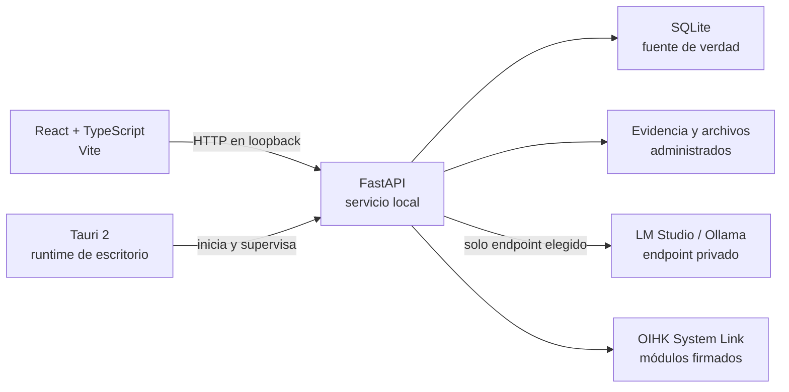

<div align="center">
  <a href="https://ko-fi.com/broskigx">
    
  </a>
</div>

# OIHK Basic

[](https://github.com/Broskigx/OIHK-Basic/actions/workflows/ci.yml)
[](VERSION)
[](LICENSE)
[](PRIVACY.md)

Plataforma de investigación local-first para organizar casos autorizados, evidencia, fuentes, relaciones, reportes y flujos de IA local desde una aplicación de escritorio Tauri.

> [!WARNING]
> **OIHK Basic es software alpha experimental para revisión técnica y pruebas controladas.** No existe una versión estable ni un instalador recomendado para producción. Puede contener fallos, funciones incompletas y cambios incompatibles. No lo uses como única copia de evidencia, datos importantes o investigaciones reales.

## Contenido

- [Qué incluye](#qué-incluye)
- [Inicio rápido desde un clon](#inicio-rápido-desde-un-clon)
- [Primera apertura y modelos locales](#primera-apertura-y-modelos-locales)
- [Configuración manual de LM Studio u Ollama](#configuración-manual-de-lm-studio-u-ollama)
- [Arquitectura](#arquitectura)
- [Calidad y pruebas](#calidad-y-pruebas)
- [Seguridad, privacidad y uso responsable](#seguridad-privacidad-y-uso-responsable)
- [Builds y releases](#builds-y-releases)
- [Documentación](#documentación)

## Estado del proyecto

La versión actual es `0.1.1-alpha.2`. El repositorio se publica para revisión de código y para testers que acepten trabajar con datos desechables y backups externos verificados.

- No hay una versión estable disponible.
- Los candidatos `0.1.1-alpha.x` son prereleases experimentales, no un canal de distribución general.
- El empaquetado Windows x64/NSIS existe, pero requiere validación en entornos limpios antes de considerarse release-ready.
- Linux y macOS tienen soporte de build en desarrollo, pero todavía no se declaran release-ready.
- No se garantiza compatibilidad de datos entre commits, soporte ni funcionamiento completo.
- Los artefactos de GitHub Actions no deben tratarse como instaladores oficiales.

Publicar una candidata alpha no significa que la aplicación esté lanzada ni lista para producción.

## Qué incluye

OIHK Basic reúne once espacios de trabajo principales:

1. **Dashboard operativo** con actividad reciente, estado local y accesos rápidos.
2. **Investigations** para crear, editar, duplicar, archivar, restaurar, importar y exportar casos.
3. **Intelligence Graph** sobre Canvas 2D con cámara, minimapa, layouts, filtros, pinning, selección múltiple, undo/redo y snapshots persistentes.
4. **OSINT Workspace** con consultas explícitas, historial SQLite, cancelación y promoción controlada al grafo.
5. **Evidence Lab** con carga por streaming, almacenamiento administrado, SHA-256, asociaciones, manifiestos y análisis forense.
6. **Reports** con secciones, plantillas, Markdown, HTML seguro, JSON, historial y aprobación de borradores.
7. **Copilot** con conversaciones persistentes y un modelo local elegido por el usuario.
8. **Local Models** con detección y configuración de LM Studio, Ollama y endpoints privados OpenAI-compatible.
9. **Data Sources** para procedencia, citas y confiabilidad.
10. **Settings** para apariencia, privacidad, rendimiento, backups y diagnósticos sanitizados.
11. **OIHK System Link** para vincular módulos OIHK instalados de forma separada mediante identidades y capacidades verificadas.

Varias capacidades siguen en desarrollo o validación. Consulta [las limitaciones conocidas](docs/KNOWN_LIMITATIONS.md) antes de probar el proyecto.

## Inicio rápido desde un clon

### Requisitos

- Git.
- Python 3.11 o superior.
- Node.js 22 (`>=22 <23`).
- Rust estable y Cargo.
- Dependencias nativas de Tauri 2 para tu sistema operativo; consulta [la guía de compilación](docs/BUILDING.md).

### 1. Clonar e instalar dependencias

```powershell
git clone https://github.com/Broskigx/OIHK-Basic.git
cd OIHK-Basic

cd backend
python -m venv .venv
.\.venv\Scripts\Activate.ps1
python -m pip install --upgrade pip
python -m pip install -e ".[dev]"

cd ..\frontend
npm ci
```

En Linux o macOS, activa el entorno Python con `source backend/.venv/bin/activate`.

### 2. Ejecutar la aplicación web de desarrollo

Backend, terminal 1:

```powershell
cd backend
.\.venv\Scripts\Activate.ps1
python run.py
```

Frontend, terminal 2:

```powershell
cd frontend
npm run dev
```

La interfaz queda normalmente en `http://127.0.0.1:5173` y la API en `http://127.0.0.1:8000`.

### 3. Ejecutar OIHK Basic con Tauri

El modo Tauri de desarrollo administra el backend local, pero Vite debe estar abierto:

```powershell
# Terminal 1
cd frontend
npm run dev

# Terminal 2 (con el entorno Python del backend activo)
cd frontend
npm run desktop:dev
```

Tauri selecciona un puerto libre en loopback, inicia `backend/run.py`, espera su health check y cierra el proceso administrado al salir de la aplicación. El build empaquetado utiliza el sidecar incluido y no requiere Python instalado.

## Primera apertura y modelos locales

En un perfil nuevo, `onboarding_complete` comienza en `false`. Al abrir OIHK Basic por primera vez, el onboarding inicia automáticamente y, en paralelo, comprueba dos endpoints de loopback:

| Runtime | Endpoint detectado | Protocolo |
| --- | --- | --- |
| LM Studio | `http://127.0.0.1:1234` | API local OpenAI-compatible |
| Ollama | `http://127.0.0.1:11434` | API nativa de Ollama |

Si un runtime responde, aparece la animación **“LM Studio detected”** o **“Ollama detected”** con la opción de revisar y conectarlo. El usuario puede:

1. elegir uno de los servicios detectados;
2. seleccionar uno de sus modelos cargados;
3. guardar la conexión local con **Connect**;
4. omitir el paso y seguir usando todas las funciones que no requieren IA;
5. abrir la configuración manual.

La detección solo lista servicios y modelos. No descarga pesos, no inicia Ollama o LM Studio, no usa una cuenta cloud y no ejecuta inferencia. El onboarding puede volver a abrirse desde **Settings → Run onboarding again**.

## Configuración manual de LM Studio u Ollama

La ruta **Local Models** permanece disponible aunque la detección automática no encuentre nada.

### LM Studio

1. Abre LM Studio y carga un modelo.
2. Inicia su servidor local OpenAI-compatible, normalmente en el puerto `1234`.
3. En OIHK Basic abre **Local Models**.
4. Selecciona **LM Studio** e ingresa `http://127.0.0.1:1234`.
5. Pulsa **List models**, elige un modelo, guarda la configuración y usa **Test inference**.

### Ollama

1. Instala Ollama y asegúrate de tener al menos un modelo local.
2. Inicia el servicio con `ollama serve` si no se está ejecutando como servicio del sistema.
3. En OIHK Basic abre **Local Models**.
4. Selecciona **Ollama** e ingresa `http://127.0.0.1:11434`.
5. Pulsa **List models**, elige un modelo, guarda la configuración y usa **Test inference**.

También se permiten endpoints HTTP(S) en IP privadas o link-local. Las URLs públicas y las credenciales embebidas en la URL se rechazan. Para cambiar los puertos que usa el detector automático en desarrollo:

```powershell
$env:OIHK_LM_STUDIO_ENDPOINT = "http://127.0.0.1:1234"
$env:OIHK_OLLAMA_ENDPOINT = "http://127.0.0.1:11434"
```

OIHK Basic no incluye modelos ni administra su instalación. La calidad, licencia, requisitos de hardware y seguridad de cada modelo son responsabilidad de quien lo ejecuta.

## Arquitectura



Principios de diseño:

- SQLite y los archivos locales son la fuente de verdad.
- La edición desktop sin autenticación escucha únicamente en loopback.
- No hay telemetría obligatoria, sincronización cloud, Redis, GraphQL, licencias ni facturación.
- Copilot no tiene fallback silencioso a un proveedor cloud.
- Una consulta OSINT no modifica el grafo hasta que el usuario promueve explícitamente el resultado.
- La evidencia no se ejecuta: se limita por tamaño, se copia a almacenamiento administrado y se verifica por hash.
- El sistema no debe fabricar resultados, fuentes ni métricas.

### Estructura del repositorio

| Ruta | Responsabilidad |
| --- | --- |
| `frontend/` | React, TypeScript, diseño de producto, grafo Canvas y cliente API. |
| `backend/app/` | FastAPI, servicios, adapters de modelos locales, persistencia y reglas de seguridad. |
| `backend/tests/` | Pruebas del servicio local y regresiones. |
| `src-tauri/` | Lifecycle desktop, sidecar, CSP, updater y empaquetado. |
| `scripts/` | Builds reproducibles, auditorías y smoke tests por plataforma. |
| `docs/` | Contratos, builds, releases, updater, System Link y limitaciones. |

## Calidad y pruebas

Desde la raíz del repositorio:

```powershell
# Python
python -m ruff check backend/app backend/run.py scripts tests
python -m pytest -q

# Frontend
cd frontend
npm run check
npm run test -- --run
npm run build
npm audit --audit-level=high

# Desktop
cd ..\src-tauri
cargo fmt -- --check
cargo check --locked
cargo test --locked --all-targets
```

Auditorías de dependencias recomendadas:

```powershell
python -m pip_audit
cd frontend
npm audit --audit-level=high
```

La integración continua ejecuta lint, pruebas, builds, auditorías, Gitleaks, smoke tests del sidecar y validaciones de empaquetado. Un pipeline verde reduce riesgos conocidos, pero no convierte una alpha en software de producción.

System Link incluye además un smoke E2E real contra un clon local de OIHK Evidence Lab:

```powershell
python scripts/smoke_system_link_e2e.py --evidence-lab C:\path\to\OiHK-evidence-lab
```

Ese smoke valida pairing, aprobación, Power On/Off, autenticación mutua, health `READY`, capabilities y rechazo de replay o paquetes alterados.

## Evidencia, reportes y backups

- La vista previa inline se limita a tipos raster considerados seguros; otros archivos se entregan como attachments.
- Los reportes exportan Markdown, HTML seguro y JSON estructurado. PDF y DOCX no forman parte del producto actual.
- Cambiar el directorio de almacenamiento requiere backup y reinicio; la relocalización en vivo está bloqueada deliberadamente.
- Backups, migraciones y recuperación continúan en evolución y no constituyen una garantía absoluta de integridad.

## Seguridad, privacidad y uso responsable

OIHK Basic está destinado al trabajo autorizado con fuentes públicas o datos incorporados legalmente por el usuario. No autoriza acceso a sistemas, cuentas ni datos privados de terceros.

- Usa datos desechables durante la etapa alpha.
- Conserva backups externos y prueba su restauración.
- Revisa toda salida de un modelo antes de incorporarla a una investigación o reporte.
- No expongas el backend sin autenticación mediante port forwarding, proxy inverso o bind público.
- Reporta vulnerabilidades mediante un advisory privado de GitHub; no adjuntes evidencia real ni secretos.

Consulta [Security Policy](SECURITY.md), [Privacy](PRIVACY.md), [Threat Model](THREAT_MODEL.md) y [Responsible Use](RESPONSIBLE_USE.md).

### Autenticación opcional

OIHK Basic es monousuario y local por defecto. Con `OIHK_AUTH_ENABLED=false`, el backend se niega a iniciar en un bind no-loopback. Los despliegues personalizados pueden activar autenticación con `OIHK_AUTH_ENABLED=true`, pero ese modo también es experimental durante la etapa alpha.

## OIHK System Link

System Link enlaza productos OIHK instalados por separado mediante identidades Ed25519, pairing local con una Link Key temporal y de un solo uso, grants de capacidades, manifests hasheados y estados de lifecycle explícitos.

OIHK Evidence Lab no está embebido en Basic: conserva instalación, proceso, UI, dominio y datos propios. Basic actúa únicamente como host/control plane y continúa funcionando sin módulos vinculados.

System Link no acepta comandos shell ni scripts arbitrarios. Solo puede ejecutar el binario relativo registrado bajo un root de instalación después de verificar su SHA-256. El contrato, las identidades Ed25519, el bridge UI y los límites de capabilities están documentados en [System Link v1](docs/SYSTEM_LINK_V1.md).

## Diferencia frente a OIHK normal

OIHK Basic conserva un flujo local de investigación, evidencia, grafo, modelos y módulos first-party, pero no incluye colaboración multiusuario, organizations, enterprise SSO, sincronización cloud, administración de conectores privados, billing, licensing, Redis, queues, GraphQL ni infraestructura distribuida. OIHK normal y OIHK Basic son productos separados.

## Builds y releases

Build local Windows sin firma ni updater:

```powershell
cd frontend
npm run release:local
```

No distribuyas ese instalador como versión oficial. Los releases alpha firmados requieren secretos de CI y un proceso separado de validación. Consulta [Building](docs/BUILDING.md), [Releasing](docs/RELEASING.md) y [Updates](docs/UPDATES.md).

## Documentación

- [Build por plataforma](docs/BUILDING.md)
- [Arquitectura](docs/ARCHITECTURE.md)
- [Limitaciones conocidas](docs/KNOWN_LIMITATIONS.md)
- [Arquitectura del updater](docs/UPDATES.md)
- [Proceso de release](docs/RELEASING.md)
- [System Link v1](docs/SYSTEM_LINK_V1.md)
- [Security Policy](SECURITY.md)
- [Privacy](PRIVACY.md)
- [Threat Model](THREAT_MODEL.md)
- [Responsible Use](RESPONSIBLE_USE.md)
- [Changelog](CHANGELOG.md)

## Licencia

MIT. Consulta [LICENSE](LICENSE).
